# 🚀 End-to-End MLOps Pipeline: Text Classification with MLflow, DVC, Docker & AWS EKS

This repository demonstrates a **full-scale, production-ready MLOps system** for a machine learning–powered text classification application.  
The project covers the **entire ML lifecycle**—from experimentation and model tracking to CI/CD, containerized deployment on Kubernetes, and production monitoring.

The emphasis of this project is on **MLOps engineering practices**, not just model training.

---

## 📌 Project Overview

The application is a **binary sentiment classification system** that predicts whether a given text expresses **positive or negative sentiment**.

Beyond prediction, the project showcases how modern ML systems are:
- Experimented with
- Versioned
- Deployed
- Monitored
- Maintained in production

---

## 🧠 What the Application Does

The application exposes a **machine learning inference service** that:

- Accepts raw text input (e.g., user reviews)
- Applies consistent text preprocessing
- Converts text into numerical features
- Uses a trained and versioned ML model to make predictions
- Returns the predicted sentiment
- Tracks runtime metrics for monitoring

The deployed system simulates a **real production ML API** rather than a research prototype.

---

## 📁 Repository Structure

```text
.
├── .github/
│   └── workflows/
├── data/
│   ├── raw/
│   ├── processed/
│   └── external/
├── flask_app/
│   ├── app.py
│   └── templates/
├── notebooks/
├── src/
│   ├── data/
│   ├── features/
│   ├── logger/
│   ├── model/
│   └── visualization/
├── scripts/
├── tests/
├── screenshots/
├── dvc.yaml
├── params.yaml
├── requirements.txt
└── README.md

---

## 🧪 Model Development & Experimentation

Multiple experiments were conducted to evaluate different modeling strategies:

- **Feature Engineering**
  - Bag-of-Words (BoW)
  - TF-IDF
- **Algorithms**
  - Logistic Regression
  - Multinomial Naive Bayes
  - Random Forest
  - Gradient Boosting
  - XGBoost
- **Evaluation Metrics**
  - Accuracy
  - Precision
  - Recall
  - F1-score

Hyperparameter tuning was performed for Multinomial Naive Bayes using grid search.  
All experiments were logged and compared systematically.

---

## 🖼️ MLflow Experiments

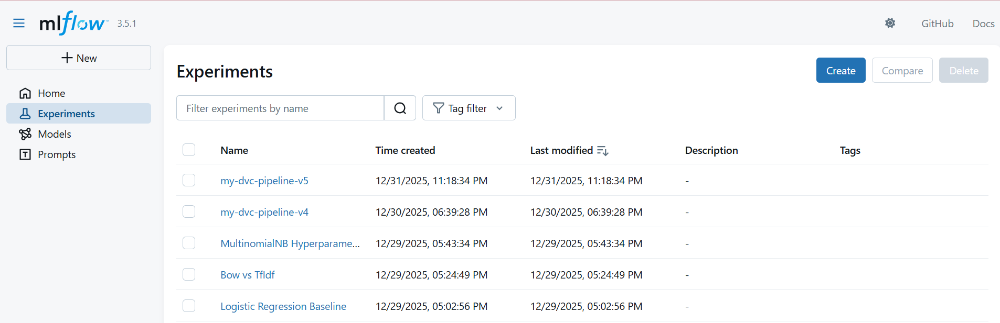

---

## 📊 Experiment Tracking & Model Registry

All experiments, parameters, metrics, and artifacts are tracked using **MLflow**, hosted remotely on **DagsHub**.

Key features used:
- Centralized experiment tracking
- Model artifact logging
- Model versioning
- Model stage transitions (e.g., Staging)

The application dynamically loads the **latest staged model** at runtime, enabling seamless model updates without code changes.

---

## 🖼️ MLflow Model Registry

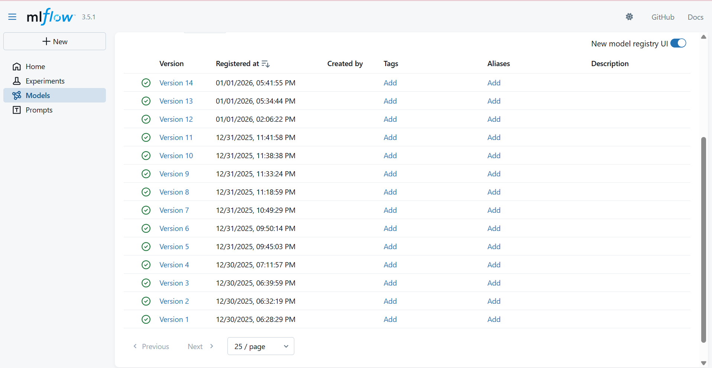

---

## 🧹 Text Preprocessing Pipeline

A unified text preprocessing pipeline is applied during both training and inference to ensure consistency:

- Lowercasing
- Stopword removal
- URL removal
- Punctuation removal
- Number removal
- Lemmatization
- Filtering of very short text samples

This prevents training–serving skew and ensures reliable predictions in production.

---

## 📦 Data & Pipeline Versioning

The complete ML workflow is versioned using **DVC**.

- Each pipeline stage is reproducible
- Data, features, and artifacts are version-controlled
- Remote storage is backed by AWS S3
- Pipeline structure is declarative and auditable

---

## 🖼️ DVC Pipeline DAG

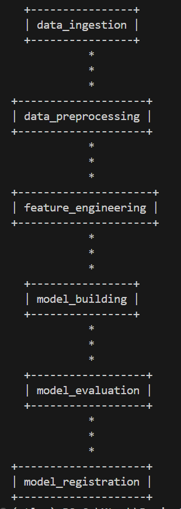

---

## 🔁 CI/CD Automation

A fully automated CI/CD pipeline is implemented using **GitHub Actions**.

The pipeline handles:
- Code validation
- Pipeline execution
- Model packaging
- Container image creation
- Secure authentication
- Deployment updates to Kubernetes

All secrets are securely managed using GitHub Secrets.

---

## 🖼️ CI/CD Workflow

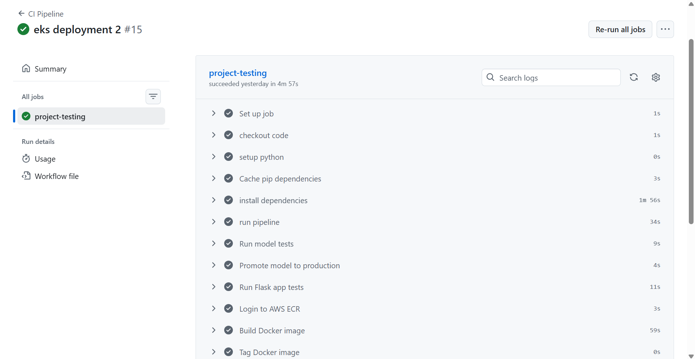
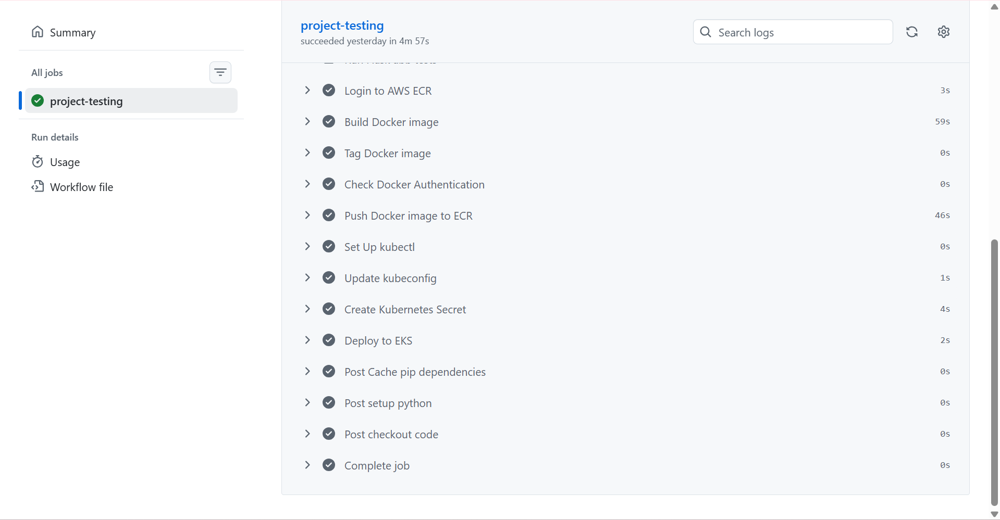

---

## 🐳 Containerized Inference Service

The trained model is served using a **Flask-based web application**, containerized with **Docker**.

Key characteristics:
- Stateless REST-style service
- Environment-driven configuration
- Portable container image
- Designed for cloud-native deployment

---

## 🖼️ Docker Image / ECR

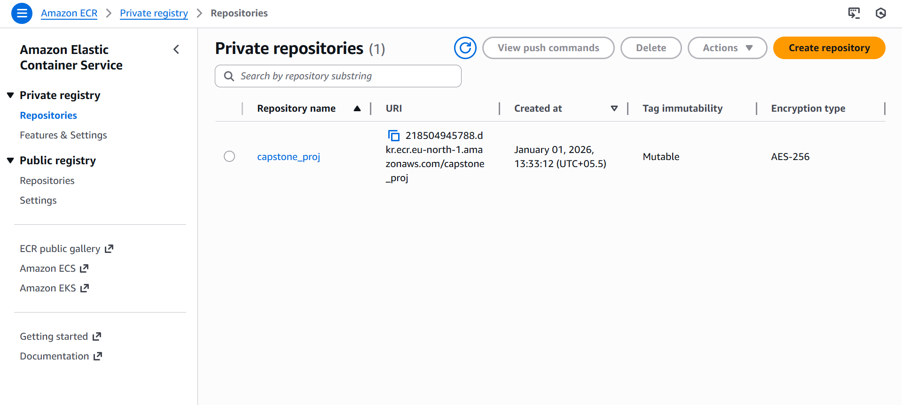
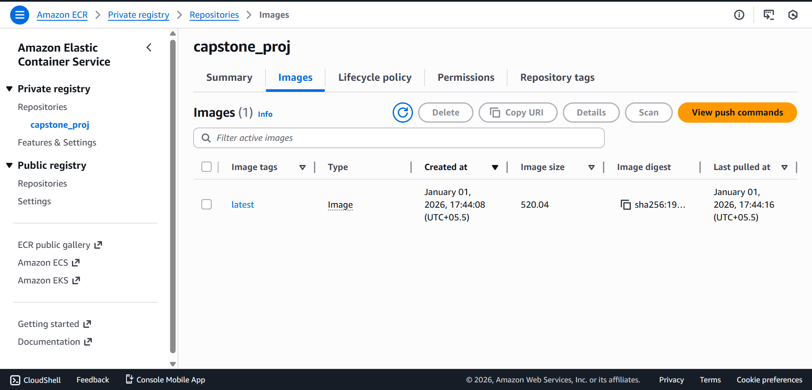

---

## ☸️ Kubernetes Deployment (AWS EKS)

The application is deployed on **AWS Elastic Kubernetes Service (EKS)**.

Deployment includes:
- Kubernetes Deployment for pod management
- LoadBalancer Service for external access
- Secure handling of environment variables
- Managed node groups for scalability

Infrastructure is provisioned using `eksctl`, which internally uses CloudFormation stacks.

---

## 🖼️ Kubernetes Resources

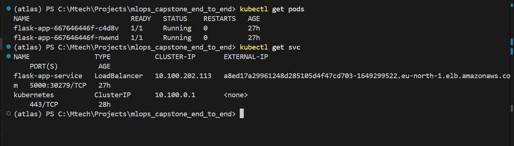

---

## 🌐 Application Access

The inference service is exposed via an external LoadBalancer endpoint.

Users can submit text and receive real-time sentiment predictions through the deployed application interface.

---

## 🖼️ Application Prediction Output

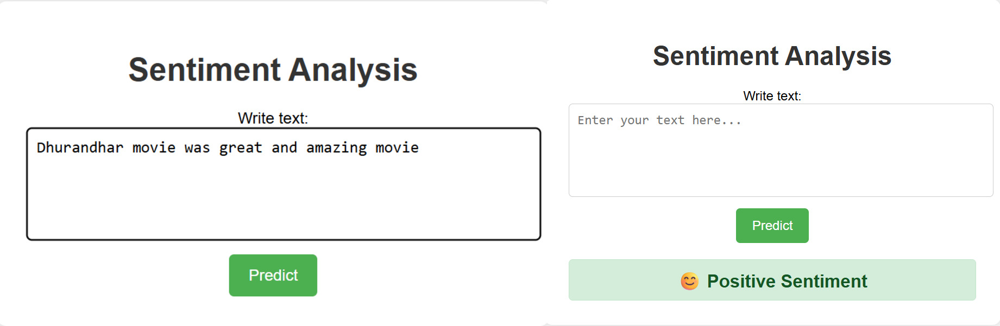

---

## 📊 Monitoring & Observability

### Prometheus
- Collects custom application metrics:
  - Request count
  - Request latency
  - Prediction counts per class

### Grafana
- Visualizes metrics through dashboards
- Enables real-time monitoring of system health and performance

---

## 🖼️ Monitoring Dashboards

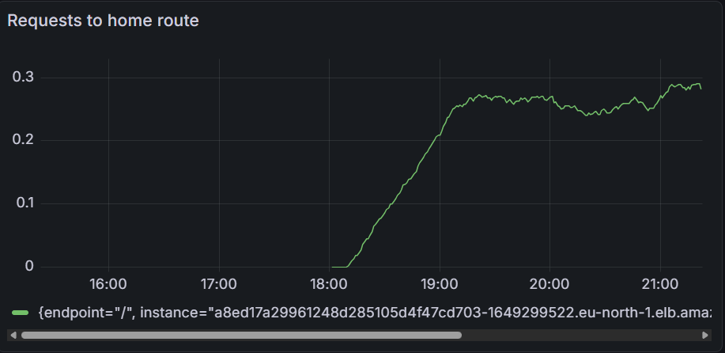
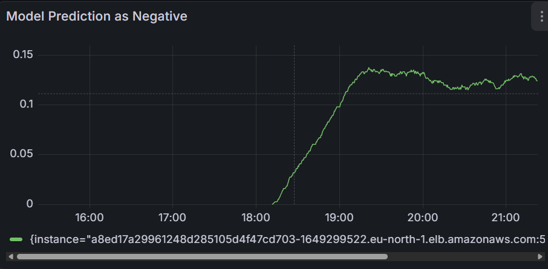

---

## 🔐 Security & Secrets Management

- No credentials are committed to the repository
- Secrets are handled using:
  - GitHub Secrets
  - Kubernetes Secrets
  - AWS IAM policies
- The repository is safe for public sharing

---

## 🧹 Resource Cleanup

All deployed resources—including Kubernetes workloads, cloud infrastructure, and storage artifacts—can be cleanly removed without leaving orphaned resources.

---

## 🎯 Key Highlights

- End-to-end MLOps lifecycle implementation
- Reproducible ML experimentation
- Model registry and versioned deployment
- Automated CI/CD pipeline
- Kubernetes-based production deployment
- Real-time monitoring and observability

---

## 👤 Author

**Somesh Joshi**  
*MLOps | Machine Learning | Cloud & Kubernetes*
